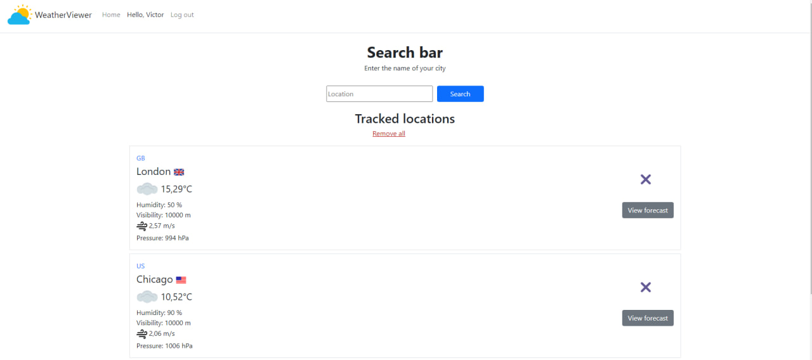
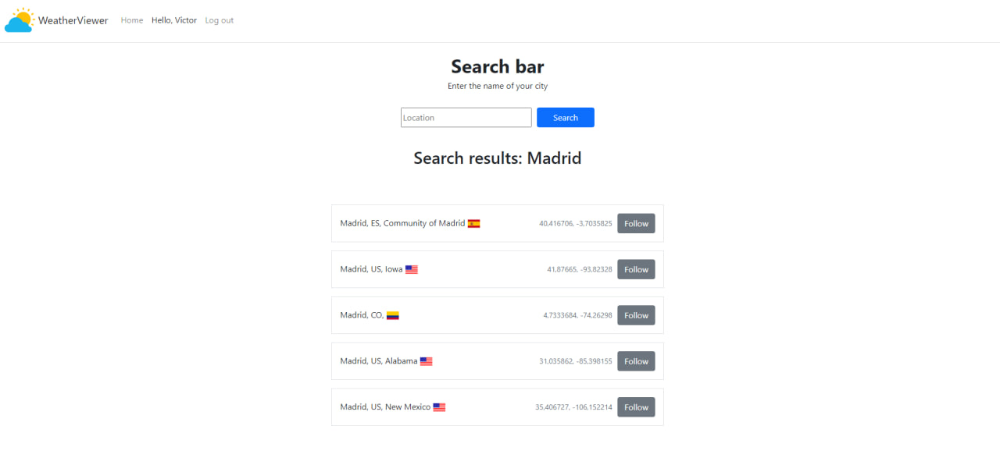
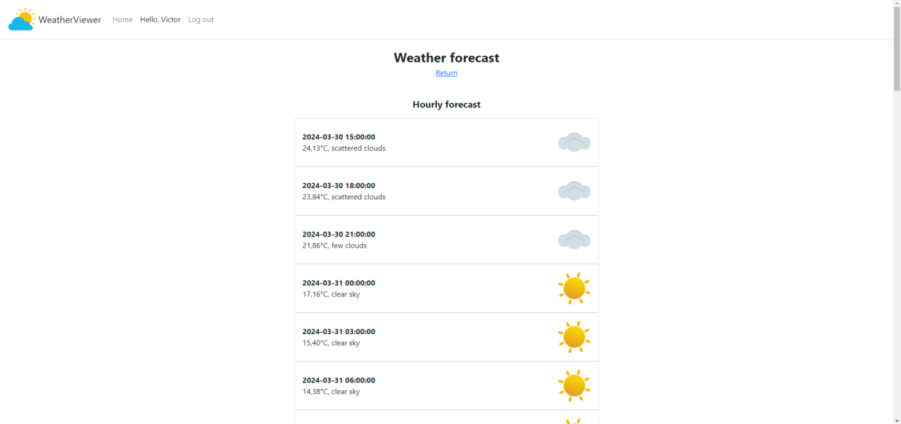

# weather-viewer

Это ASP.NET Core MVC приложение, предоставляющее информацию о текущей погоде и прогнозах с помощью OpenWeatherAPI.





# Инструменты

<ul>
<li>.NET 8.0</li>
<li>ASP.NET Core MVC</li>
<li>Dapper</li>
<li>Microsoft SQL Server</li>
</ul>

# Функции

<ol>
<li>
Работа с пользователями:
</li>
<ul>
<li>
регистрация;
</li>
<li>
авторизация;
</li>
<li>
выход.
</li>
</ul>
<li>
Работа с локациями:
</li>
<ul>
<li>
поиск локации по названию;
</li>
<li>
добавление локации в отслеживаемые;
</li>
<li>
просмотр текущей погоды для отслеживаемых локаций;
</li>
<li>
просмотр почасового прогноза;
</li>
<li>
удаление локаций из списка.
</li>
</ul>
</ol>

# Установка

<h3>Настройка конфигурации</h3>
Для использования OpenWeatherMap API необходимо получить API ключ. Зарегистрируйтесь на https://openweathermap.org/api и добавьте свой ключ в файле appsettings.json:

```
"ApiKey": "your api key",
```
